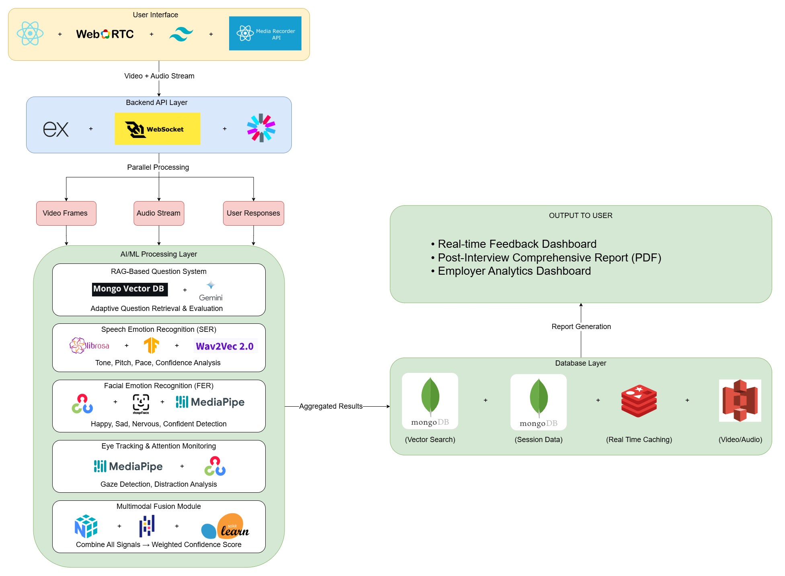

# AI Multi-Modal Interview Assistant

**AI-powered interview practice system combining RAG, speech emotion recognition, facial analysis, and eye tracking to provide comprehensive feedback for campus placement preparation.**

---

## 🎯 Hackathon Submission

**Track:** Student Track - AI for Learning & Developer Productivity  
**Team:** Status Code 404   
**Institution:** Techno International New Town, Department of Information Technology

---

## 📄 Documentation

- **[Requirements Document](requirements.md)** - Generated using Kiro
- **[Design Document](design.md)** - Generated using Kiro
- **[Architecture Diagram](docs/architecture.png)** - System architecture visualization
- **[Presentation](docs/presentation.pdf)** - Project pitch deck

---

## 🚀 Problem Statement

Students struggle with campus placement interviews due to:
- ❌ Limited realistic mock interview practice
- ❌ No feedback on non-verbal communication (tone, facial expressions, attention)
- ❌ Inability to identify weak areas
- ❌ Low confidence entering real interviews

---

## 💡 Our Solution

An intelligent interview assistant that:

✅ **RAG-Based Adaptive Questioning**  
   - MongoDB Vector Search + Google Gemini embeddings
   - Context-aware question retrieval
   - Intelligent follow-ups for weak answers (score < 3)

✅ **Multimodal Analysis**  
   - **Speech Emotion Recognition**: librosa, TensorFlow, wav2vec 2.0
   - **Facial Emotion Detection**: OpenCV, DeepFace, MediaPipe
   - **Eye Tracking**: MediaPipe Face Mesh for attention monitoring

✅ **Real-time Feedback**  
   - Live confidence, attention, and emotion scores
   - Adaptive question generation during interview

✅ **Comprehensive Reports**  
   - PDF reports with detailed analytics
   - Session history tracking
   - Progress visualization

---

## 🏗️ Architecture



**Key Components:**
- **Frontend**: React.js, WebRTC, Tailwind CSS
- **Backend**: Express.js, Socket.io, JWT Auth
- **RAG Engine**: MongoDB Vector Search, Gemini API
- **ML Pipeline**: Speech/Facial/Eye analysis with multimodal fusion
- **Storage**: MongoDB Atlas, Redis, AWS S3

---

## 🛠️ Technology Stack

### Frontend
- React.js
- Tailwind CSS
- WebRTC
- MediaRecorder API

### Backend
- Express.js (Node.js)
- Socket.io
- JWT Authentication

### AI/ML
- **RAG System**: MongoDB Atlas Vector Search, Google Gemini (gemini-embedding-001, gemini-2.0-flash-lite)
- **Speech Emotion Recognition**: librosa, TensorFlow, wav2vec 2.0
- **Facial Emotion Recognition**: OpenCV, DeepFace, MediaPipe
- **Eye Tracking**: MediaPipe Face Mesh
- **Multimodal Fusion**: NumPy, Pandas, Scikit-learn

### Database
- MongoDB Atlas (Vector DB + Session Data)
- Redis (Caching)
- AWS S3 (Media Storage)

---

## 📊 Implementation Status

### ✅ Completed
- RAG system with MongoDB Vector Search
- Backend API with adaptive evaluation
- Question vectorization and retrieval
- Session management and history
- Answer scoring with follow-up logic

### 🔄 In Progress
- Frontend React application
- ML model integration (SER, FER, Eye Tracking)
- Multimodal fusion module

### 📅 Planned
- PDF report generation
- Employer analytics dashboard
- Mobile app support

---

## 🎓 Key Features

| Feature | Description |
|---------|-------------|
| **Adaptive Questioning** | RAG-based vector search retrieves contextually relevant questions |
| **Score-Based Follow-ups** | Score < 3 → probing question; Score ≥ 3 → new topic |
| **3072-dim Embeddings** | Google Gemini embeddings for semantic similarity |
| **Multimodal Analysis** | Parallel processing of speech, facial, and eye data |
| **Real-time Feedback** | Live confidence, attention, and emotion metrics |
| **Session Tracking** | Complete history with progress visualization |

---

## 🔗 API Endpoints
```
POST   /start              → Start new interview session
POST   /answer             → Submit answer and get evaluation
GET    /health             → System health check
GET    /debug/questions    → Database diagnostics
```

---

## 📈 Impact

### For Students
- ✅ Unlimited practice with realistic feedback
- ✅ Identify communication weaknesses
- ✅ Track improvement over time
- ✅ Build confidence before real interviews

### For Institutions
- ✅ Monitor student placement readiness
- ✅ Data-driven career counseling
- ✅ Improve overall placement success rates

---

## 📞 Contact

For questions or collaboration:
- GitHub: https://github.com/Tridip-Sardar
- Email: tridipsardar92@gmail.com

---

## 📄 License

This project was developed for AI For Bharat 2026.

---

**Built with ❤️ for better interview preparation**
